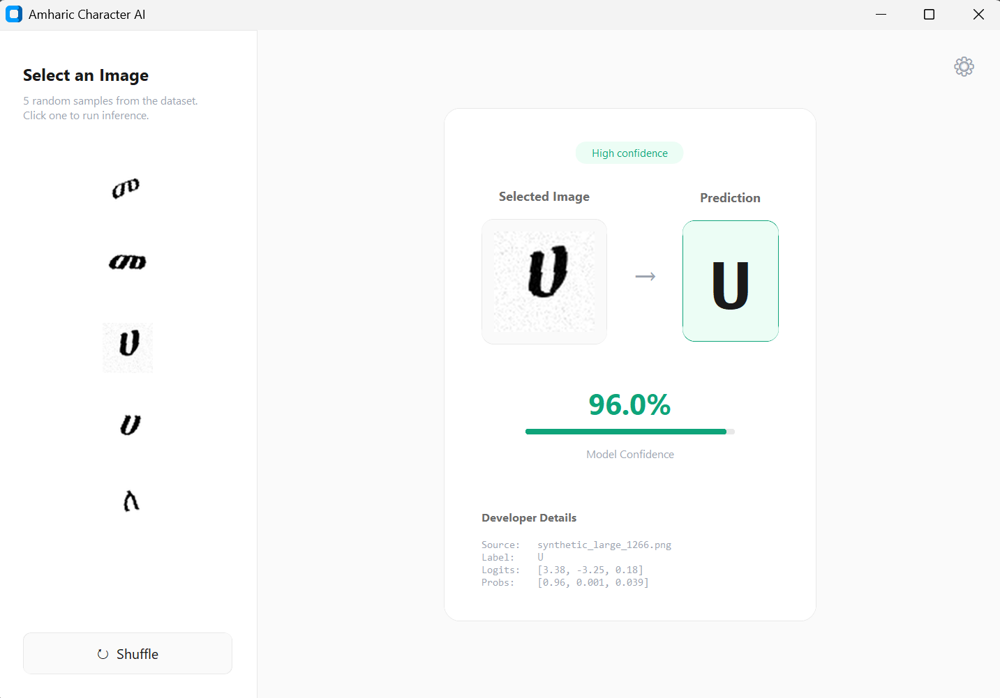
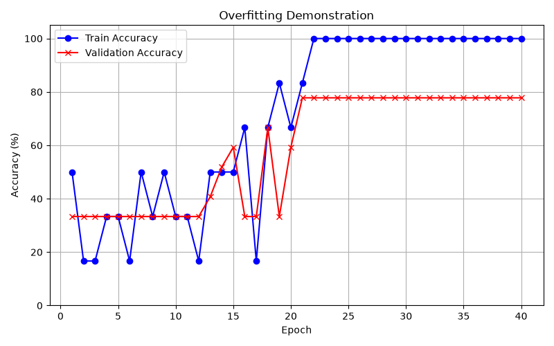
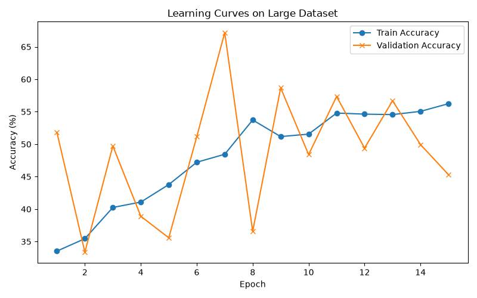
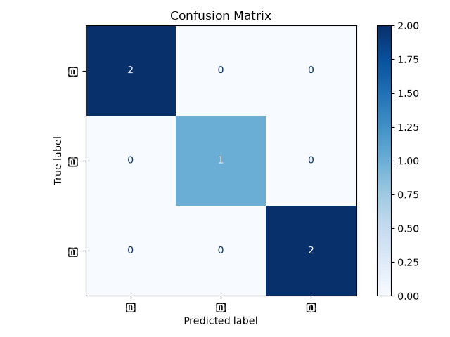

# Amharic Character Recognition AI

A supervised machine-learning project for building an Amharic/Ethiopic character recognition system from the ground up using Python and PyTorch.

The purpose of this project is not simply to produce a working OCR application. The main objective is to understand how an artificial neural network actually learns: how images become numbers, how those numbers pass through a model, how predictions are produced, how mistakes are measured, and how the model gradually changes itself through training.

The project intentionally begins at a very small scale and grows step by step.

---

## Project Goal

The first goal is simple:

```text
Image containing one Ethiopic character
              ↓
         Neural Network
              ↓
        Predicted Character
```

For example:

```text
Input image: ሀ

Model prediction:
ሀ
```

The initial model only recognizes a very small set of characters:

```text
ሀ
ለ
መ
```

These classes are currently represented numerically as:

```text
ሀ → 0
ለ → 1
መ → 2
```

The project will gradually expand after the basic learning pipeline works correctly.

---

## Interactive Interface

As part of Phase 21, the project now features a modern, responsive Graphical User Interface (GUI) built with `customtkinter`. The interface allows users to sample images from the dataset and run real-time inference, displaying predicted characters alongside model confidence percentages and raw developer metrics.



---

# Why This Project Exists

Modern AI tools make it possible to build applications without deeply understanding the machine-learning systems behind them.

This project deliberately takes the opposite approach.

The goal is to understand the complete pipeline:

```text
raw image
↓
pixels
↓
tensor
↓
dataset
↓
labels
↓
batch
↓
neural network
↓
logits
↓
prediction
↓
loss
↓
gradients
↓
optimizer
↓
updated weights
↓
better prediction
```

Every important stage is being implemented and studied separately before it is combined into a complete training system.

---

# Learning Type

This project uses:

## Supervised Learning

In supervised learning, the model receives both:

```text
input
+
correct answer
```

For example:

```text
image of ሀ
+
label 0
```

The neural network produces its own prediction.

The prediction is compared against the known correct answer.

The difference is converted into a value called the **loss**.

The model then uses gradients and an optimizer to modify its internal weights in a direction that should reduce that loss.

The process repeats many times.

```text
image + label
↓
prediction
↓
loss
↓
backpropagation
↓
gradients
↓
weight update
↓
repeat
```

This is different from reinforcement learning, where an agent learns through actions, rewards, penalties, and interaction with an environment.

Character classification does not require an agent or reward system because the correct answers are already available in the training dataset.

---

# Current Dataset

The current dataset contains three classes:

```text
data/
├── ሀ/
├── ለ/
└── መ/
```

The folder itself acts as the label.

For example:

```text
data/ሀ/synthetic_001.png
```

means:

```text
Input:
synthetic_001.png

Correct answer:
ሀ
```

PyTorch converts these character labels into numerical classes:

```text
ሀ → 0
ለ → 1
መ → 2
```

The current experimental dataset contains approximately 33 images.

It includes synthetic examples created using Ethiopic-compatible fonts and multiple font sizes.

This dataset is intentionally tiny because the current objective is understanding the machine-learning pipeline rather than maximizing accuracy.

---

# Synthetic Dataset Generation

The project currently generates character images programmatically.

A typical generation process is:

```text
create 64 × 64 image
↓
load Ethiopic font
↓
select character
↓
measure character
↓
center character
↓
draw character
↓
save PNG
```

The current generator uses fonts such as:

```text
Abyssinica SIL
Nyala
```

and multiple font sizes.

Future dataset generation may include:

* different fonts
* different character positions
* rotation
* controlled blur
* brightness variation
* noise
* contrast variation
* background variation
* printing and scanning artifacts
* compression artifacts
* handwritten samples

Synthetic transformations must remain realistic. An augmentation should never distort one Ethiopic character so severely that it becomes visually equivalent to another character.

---

# Image Representation

The current images are:

```text
64 × 64 pixels
grayscale
```

A neural network does not actually see:

```text
ሀ
```

the way a human sees it.

The image is converted into numbers.

A grayscale pixel can be represented approximately as:

```text
0.0 → black
1.0 → white
```

The image becomes a PyTorch tensor with the shape:

```text
[1, 64, 64]
```

which means:

```text
1  grayscale channel
64 pixels high
64 pixels wide
```

A batch of four images therefore has the shape:

```text
[4, 1, 64, 64]
```

---

# Dataset Splitting

The current experimental dataset is divided into approximately:

```text
23 training images
5 validation images
5 test images
```

These sets serve different purposes.

## Training Set

The model learns from these images.

## Validation Set

Used during model development to see whether the model is learning patterns that generalize beyond its training examples.

## Test Set

Used as a final evaluation on images the model did not train on.

A serious future dataset will require more careful splitting, particularly for handwritten samples. Samples from the same writer should not necessarily appear in both the training and test sets.

---

# Current Neural Network

The first model is intentionally extremely simple.

```text
64 × 64 image
↓
4096 pixel values
↓
Flatten
↓
Linear layer
↓
3 output scores
```

Because:

```text
64 × 64 = 4096
```

the first model receives 4096 numerical pixel values.

It produces three output scores because there are currently three possible classes:

```text
ሀ
ለ
መ
```

These raw output scores are called **logits**.

For example:

```text
[0.3, 1.8, 0.1]
```

could correspond to:

```text
ሀ → 0.3
ለ → 1.8
መ → 0.1
```

The largest logit currently represents the predicted class.

Here:

```text
1.8
```

is the largest value, so the prediction would be:

```text
ለ
```

---

# Loss

The correct answer is not another group of three numbers.

The correct answer is one class label.

For example:

```text
Correct label:
1
```

means:

```text
ለ
```

The model might output:

```text
[0.3, 1.8, 0.1]
```

The loss function compares those model outputs against the known correct label.

The project currently uses:

```python
CrossEntropyLoss
```

The result is one loss value.

Conceptually:

```text
model prediction
+
correct answer
↓
loss
```

A smaller loss generally means the model's predictions are better aligned with the correct answers.

---

# Backpropagation and Gradients

After calculating loss, PyTorch can perform:

```python
loss.backward()
```

This performs backpropagation.

Backpropagation calculates gradients.

A gradient tells us how changing a particular value would affect the loss.

Very approximately:

```text
increase this weight slightly
decrease this weight slightly
change this one more strongly
change this one less strongly
```

Gradients do not update the neural network by themselves.

They only provide the information necessary to determine how the weights should change.

An optimizer will perform the actual parameter updates.

---

# Current Project Status

Completed:

* Python environment setup
* virtual environment
* PyTorch installation
* torchvision installation
* NumPy installation
* Pillow installation
* Matplotlib installation
* scikit-learn installation
* Git repository setup
* private GitHub repository
* `.gitignore`
* synthetic Ethiopic character generation
* automatic character centering
* class folders
* image loading
* image-to-tensor conversion
* numerical class labels
* dataset loading
* train/validation/test splitting
* DataLoader and batches
* first neural-network architecture
* forward pass
* logits
* class prediction
* CrossEntropyLoss
* backpropagation
* gradient inspection

Current position:

```text
Loss
↓
Backpropagation
↓
Gradients
↓
WE ARE HERE
↓
Optimizer
↓
Weight updates
↓
Training loop
```

The neural network has now successfully progressed through multiple training phases.

---

# Training Metrics & Experiments

During our experiments, we actively tracked loss and accuracy to understand how the model learns.

### Overfitting Demonstration
We intentionally forced the model to overfit on a tiny dataset to prove it possesses the capacity to memorize patterns. As the training loss reached zero, the validation loss diverged, clearly illustrating the overfitting phenomenon:



### Large Dataset Training
After scaling up to a 6,000-image augmented synthetic dataset, the model learned much more generalized features. Here is the learning curve showing stable convergence on a larger scale:



### Error Analysis
We also generated confusion matrices to understand exactly which characters the model struggles to differentiate:



---

# Near-Term Goals

The next major milestones are:

1. Understand optimizers.
2. Update model weights.
3. Build the first complete training loop.
4. Train using actual Ethiopic character images.
5. Track loss over epochs.
6. Track training accuracy.
7. Evaluate validation accuracy.
8. Evaluate test accuracy.
9. Inspect incorrect predictions.
10. Save the trained model.
11. Load the trained model.
12. Predict an unseen character image.

---

# Future Model Architecture

The current linear model is intentionally primitive.

A future version will use a Convolutional Neural Network.

Conceptually:

```text
image
↓
convolution
↓
feature maps
↓
activation
↓
pooling
↓
more learned features
↓
flatten
↓
fully connected layer
↓
character prediction
```

A CNN should be significantly better suited to recognizing visual structures such as:

* lines
* curves
* intersections
* edges
* character components
* spatial patterns

---

# Long-Term Vision

The project can expand through several stages.

## Stage 1 — Isolated Printed Characters

Recognize individual Ethiopic characters from clean generated images.

## Stage 2 — Larger Character Set

Expand beyond the initial three characters.

## Stage 3 — Stronger Synthetic Dataset

Introduce more fonts, positions, scales, distortions, and realistic image variation.

## Stage 4 — Handwritten Character Recognition

Collect samples from multiple writers and train the model to recognize handwriting.

## Stage 5 — Character Detection and Segmentation

Locate individual characters inside larger images.

## Stage 6 — Word Recognition

Recognize complete Amharic words rather than isolated characters.

## Stage 7 — Line Recognition

Process entire lines of Amharic text.

## Stage 8 — Full Amharic OCR

Convert photographs, scanned pages, documents, or signs into machine-readable Amharic text.

## Stage 9 — Language-Aware OCR

Combine computer vision with natural-language processing.

The visual model may occasionally be uncertain between visually similar characters.

A future language model could use surrounding characters and words to determine which interpretation makes linguistic sense.

```text
computer vision
+
Amharic language model
↓
context-aware OCR
```

---

# Possible Advanced Projects Using These Skills

The knowledge developed here could later support projects such as:

* Amharic handwritten-note digitization
* historical Ethiopian document digitization
* searchable Amharic document archives
* automatic transcription of scanned documents
* Amharic educational tools
* handwriting-learning applications
* document information extraction
* receipt and invoice recognition
* Ethiopian identity/document processing systems
* sign and street-text recognition
* mobile Amharic OCR
* accessibility tools
* Amharic speech-to-text systems combined with NLP
* multilingual Ethiopian-language AI systems
* document translation pipelines
* intelligent document search
* visual question answering for Ethiopian documents
* archive preservation systems
* Amharic text correction systems
* multimodal Ethiopian-language AI

---

# Philosophy of the Project

The primary measure of success is not simply accuracy.

The goal is understanding.

Every major component should eventually be explainable without relying on an AI assistant:

```text
What is the input?

Why is it represented this way?

What does the neural network receive?

What does the network output?

What is a logit?

What is loss?

What is a gradient?

What does backpropagation do?

What does the optimizer change?

Why does training improve predictions?

How do we know the model generalizes?

Where does the model fail?

How could the system be improved?
```

The finished project should demonstrate not only that an AI system was built, but that the engineering and machine-learning principles behind it were understood.
