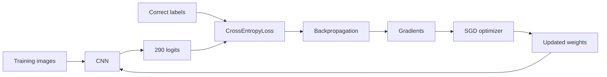
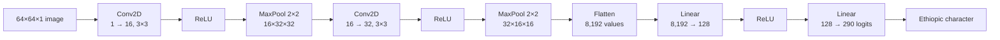
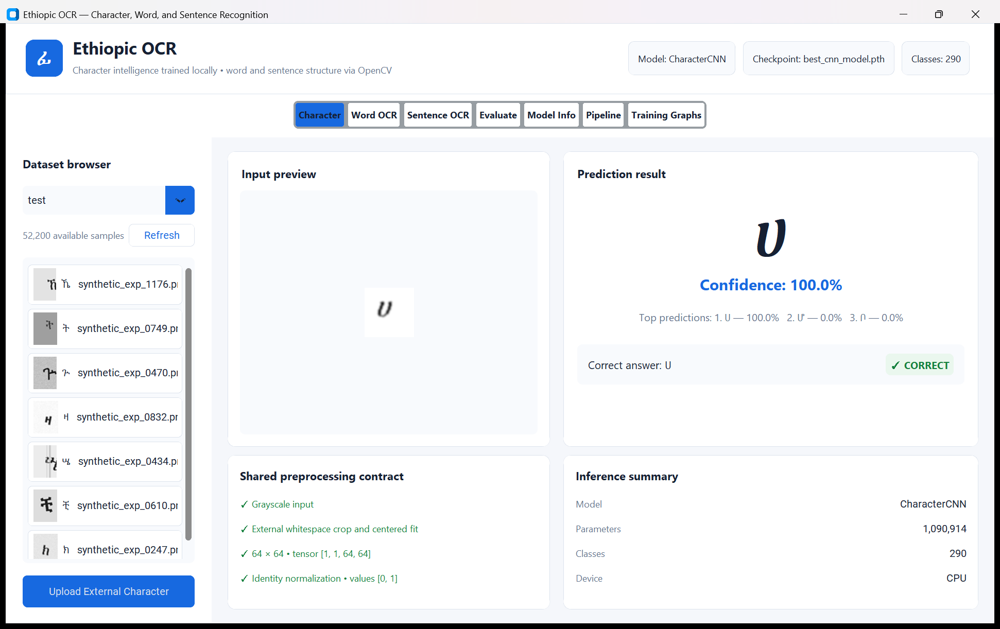
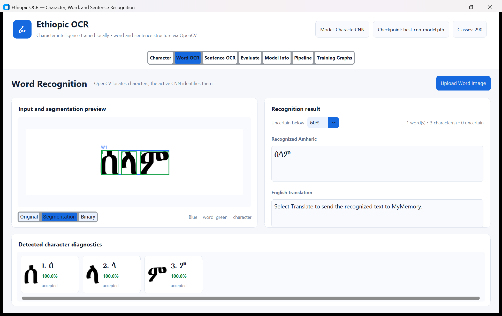
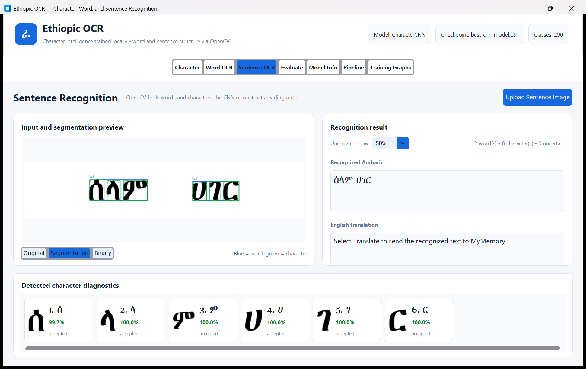
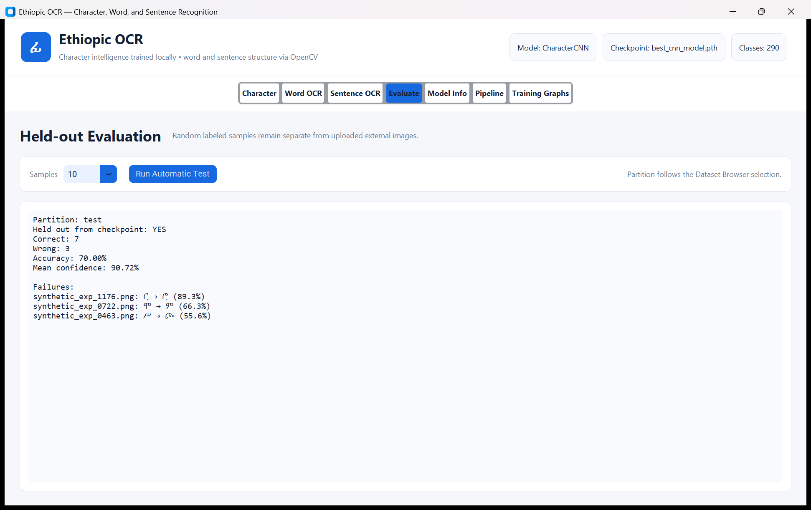
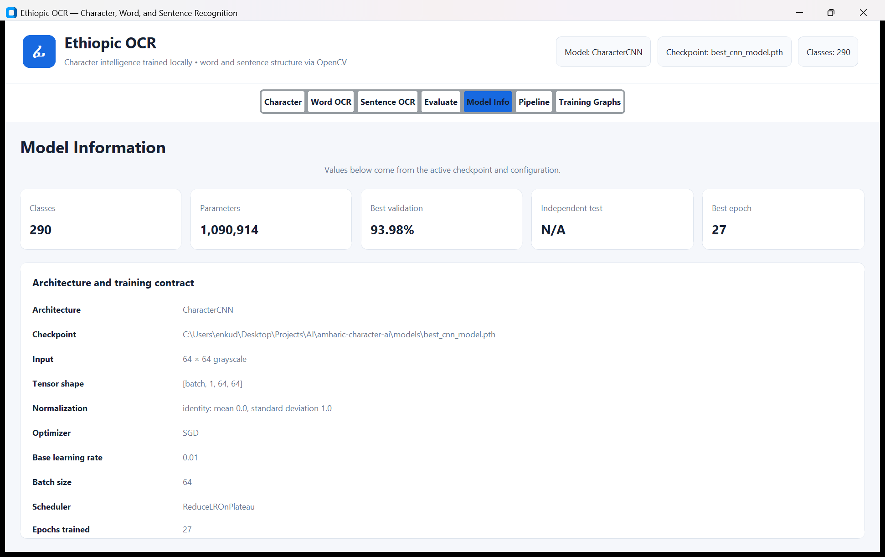
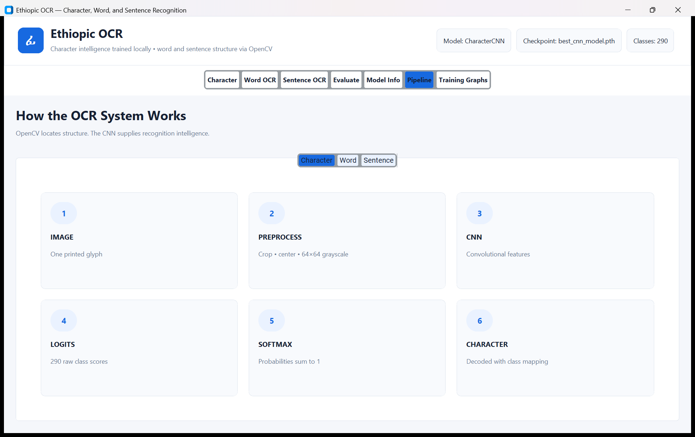
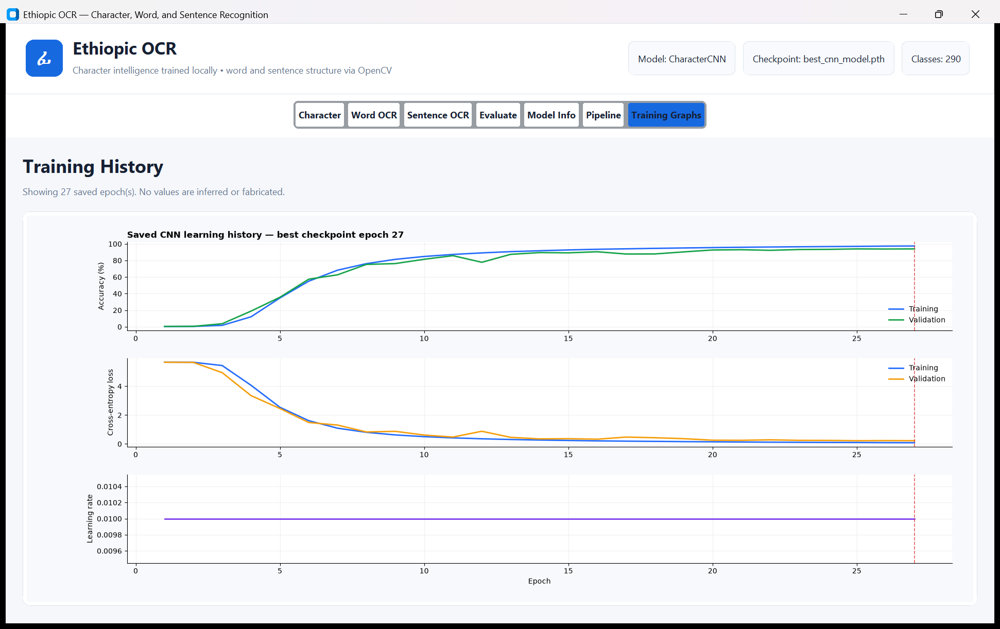

<h1 align="center">Ethiopic: A Supervised Learning Pipeline</h1>

<p align="center"><em>From labeled Ethiopic pixels to locally trained character, word, and sentence OCR</em></p>

An educational, end-to-end Amharic and Ethiopic Optical Character Recognition (OCR) ecosystem built with Python, PyTorch, OpenCV, Pillow, and CustomTkinter, specifically designed as a hands-on foundation for supervised learning, AI model training, and algorithmic development.

The application recognizes a single printed character with a locally trained 290-class convolutional neural network (CNN). It can also segment a printed word or line into character crops, classify every crop with that same CNN, restore reading order, and optionally translate the reconstructed Amharic text into English.

> Mature OCR and translation systems already exist. This project is educational and experimental: I am building the recognition pipeline myself to understand supervised learning, neural-network training, computer vision, CNNs, evaluation, generalization, OCR segmentation, and the engineering needed to turn trained intelligence into a usable application.

The goal is not to call an existing OCR model as a black box. The goal is to understand how machine intelligence is trained.

## Current status

The repository now supports three explicit recognition paths:

| Mode | Pipeline | Status |
| --- | --- | --- |
| Character | image → shared preprocessing → local CNN → Ethiopic class | Implemented |
| Word OCR | image → OpenCV character segmentation → local CNN → word | Implemented for clean printed text |
| Sentence OCR | line image → relative gap analysis → words/characters → local CNN → text | Implemented for clean printed lines |
| Translation | reconstructed Amharic text → replaceable external provider → English | Optional; OCR remains usable offline |

The active checkpoint and all earlier learning artifacts are preserved. Word and sentence recognition reuse the existing CNN; no word-level model has replaced it.

## Technology stack

The stack is intentionally separated by responsibility so each layer of the system remains understandable and replaceable.

| System level | Technology | Responsibility |
| --- | --- | --- |
| Language and runtime | Python 3.12 | Application, training, inference, and tooling |
| Deep learning | PyTorch | CNN architecture, tensors, training, checkpoints, and inference |
| Dataset utilities | torchvision | Image-folder datasets and tensor transforms |
| Computer vision | OpenCV | Thresholding, morphology, connected components, segmentation, and reading order |
| Image processing | Pillow and NumPy | Image loading, drawing, crop preparation, and pixel arrays |
| Desktop interface | CustomTkinter and Tkinter | Full-window OCR workflow, uploads, previews, and diagnostics |
| Model visualization | Matplotlib | Real training accuracy, loss, and learning-rate graphs |
| Translation integration | Python `urllib` and MyMemory | Optional Amharic-to-English text translation after OCR |
| Verification | `unittest` | Segmentation, preprocessing, inference, reconstruction, translation, and metadata tests |
| Version control | Git and GitHub | Source history, granular commits, collaboration, and documentation |

No external OCR model, hosted AI model, or Vercel service performs recognition. Character intelligence comes from the local `CharacterCNN` checkpoint in this repository.

## Why supervised learning is central

Every training example contains an image and its correct class label. The CNN produces 290 logits, cross-entropy measures how wrong those scores are, backpropagation computes gradients, and the optimizer updates the weights.



The project has deliberately evolved from first principles:

```text
synthetic character generation
→ pixels
→ tensors
→ labels
→ supervised learning
→ loss and gradients
→ optimizer
→ linear classifier
→ CNN
→ 290 character classes
→ generalized character recognition
→ word segmentation
→ sentence OCR
→ optional translation
```

## Learning objectives

- Build and validate labeled datasets.
- Understand image tensors, batches, and class mappings.
- Understand neural networks, logits, probabilities, and confidence.
- Use cross-entropy loss, backpropagation, gradients, and optimization.
- Train a CNN and measure generalization on independent partitions.
- Diagnose overfitting, class confusion, and preprocessing mismatch.
- Recognize the 290-character Ethiopic inventory in `src/characters.json`.
- Segment printed words and lines without assuming one contour equals one glyph.
- Reconstruct words and sentences in reading order.
- Integrate translation without outsourcing OCR intelligence.

## Active model

The values below come from `models/cnn_model_config.json`, the active checkpoint, and the saved epoch CSV. They are not estimated.

| Property | Current value |
| --- | ---: |
| Architecture | `CharacterCNN` |
| Classes | 290 |
| Parameters | 1,090,914 |
| Input | 64 × 64 grayscale |
| Tensor shape | `[batch, 1, 64, 64]` |
| Dataset images | 348,000 |
| Training images | 243,600 |
| Validation images | 52,200 |
| Test images | 52,200 |
| Epochs completed | 27 |
| Epoch 27 training accuracy | 97.4224% |
| Best validation accuracy | 93.9751% |
| Best checkpoint epoch | 27 |
| Independent full-test accuracy | Not yet recorded; training was interrupted before final evaluation |
| Optimizer | SGD, base learning rate 0.01 |

The small evaluation shown in the GUI is an on-demand diagnostic over labeled held-out samples. It is not presented as the missing full-test metric.

### CNN architecture



Softmax is applied during inference to present probabilities. It is intentionally not applied before `CrossEntropyLoss` during training.

## OCR architecture

OpenCV and the CNN have separate responsibilities:

```text
OpenCV = WHERE are the words and characters?
CNN    = WHAT character is in each crop?
```



```mermaid
flowchart LR
    A[Word or line image] --> B[Grayscale and polarity-aware thresholding]
    B --> C[Noise removal and connected components]
    C --> D[Group disconnected glyph pieces]
    D --> E[Projection-based wide-component splitting]
    E --> F[Relative line and whitespace grouping]
    F --> G[Ordered character crops]
    G --> H[Shared 64×64 preprocessing]
    H --> I[Active CharacterCNN]
    I --> J[Character predictions and confidence]
    J --> K[Reconstructed Amharic text]
    K -. optional text only .-> L[Translation provider]
    L -.-> M[English text]
```

The segmenter uses relative image and component dimensions rather than a single hard-coded pixel gap. It groups plausible disconnected pieces by overlap, distance, baseline, and size, and it exposes blue word boxes plus green character boxes for diagnosis.

Every recognized character retains:

- bounding box;
- extracted crop;
- raw CNN prediction;
- confidence;
- ranked alternatives;
- uncertainty state.

The configurable confidence threshold affects the displayed text, not the underlying diagnostic prediction. A low-confidence crop is shown as `?`; its raw CNN result remains available.

### Shared preprocessing contract

Dataset samples, uploaded characters, and segmented OCR crops all pass through `src/preprocessing.py`.

```text
image/crop
→ grayscale
→ trim external whitespace
→ preserve aspect ratio
→ fit to 55% foreground occupancy
→ center on a 64×64 canvas
→ tensor [1, 64, 64]
→ identity normalization in [0, 1]
```

The 55% fit was selected with a 1,160-render sweep across all 290 classes and four installed Ethiopic fonts. This brought external printed glyph scale into line with the training distribution; it does not alter the saved weights.

## Desktop application

The maximized, light-theme desktop UI includes:

- character dataset browser, uploads, confidence, top-3 predictions, and correctness;
- word and sentence upload modes;
- original, binary, and segmentation previews;
- per-crop diagnostics and uncertain-character handling;
- optional translation and copy controls;
- held-out sample evaluation;
- checkpoint-derived model information;
- visual character/word/sentence pipeline explanations;
- real training accuracy, loss, and learning-rate graphs.

## Demo screenshots

All screenshots below were captured from the implemented application. The documentation utility renders printed samples, runs the real active CNN and segmentation pipeline, runs a real small held-out evaluation, and captures the resulting windows. They are displayed directly rather than hidden inside a collapsed section.

<table>
  <tr>
    <td width="50%" valign="top">
      <strong>Character prediction</strong><br><br>
      
    </td>
    <td width="50%" valign="top">
      <strong>Word OCR and segmentation</strong><br><br>
      
    </td>
  </tr>
  <tr>
    <td width="50%" valign="top">
      <strong>Sentence OCR</strong><br><br>
      
    </td>
    <td width="50%" valign="top">
      <strong>Held-out evaluation</strong><br><br>
      
    </td>
  </tr>
  <tr>
    <td width="50%" valign="top">
      <strong>Model information</strong><br><br>
      
    </td>
    <td width="50%" valign="top">
      <strong>OCR pipeline</strong><br><br>
      
    </td>
  </tr>
  <tr>
    <td width="50%" valign="top">
      <strong>Segmentation overlay</strong><br><br>
      
    </td>
    <td width="50%" valign="top">
      <strong>Saved training history</strong><br><br>
      
    </td>
  </tr>
</table>

> If GitHub is still processing a newly pushed image, open the corresponding file in `docs/screenshots/` and refresh the README after a few seconds.

## Installation

The examples below use Windows Command Prompt from the repository root.

```bat
cd /d "C:\Users\enkud\Desktop\Projects\AI\amharic-character-ai"
python -m venv .venv
.venv\Scripts\python.exe -m pip install --upgrade pip
.venv\Scripts\python.exe -m pip install -r requirements.txt
```

Run the desktop app:

```bat
.venv\Scripts\python.exe src\gui.py
```

Run single-character inference from the command line:

```bat
.venv\Scripts\python.exe src\predict.py path\to\character.png
```

Run the automated tests:

```bat
.venv\Scripts\python.exe -m unittest discover -s tests -v
.venv\Scripts\python.exe test_gui_script.py
```

Regenerate the real documentation screenshots:

```bat
.venv\Scripts\python.exe scripts\capture_gui_screenshots.py
```

### Resume training safely

`--max-epochs` is a cumulative target. Because the latest compatible checkpoint has completed epoch 27, this command resumes at epoch 28 and stops at epoch 200 or earlier if early stopping triggers:

```bat
.venv\Scripts\python.exe src\train.py --max-epochs 200 --num-workers 2
```

Do not add `--fresh` unless you deliberately want to archive the current active training artifacts and start again from random weights.

## Optional Amharic-to-English translation

OCR runs locally and does not require translation or internet access. Translation is a separate, replaceable step implemented in `src/translation.py`.

The default provider is the documented MyMemory GET API:

```text
https://api.mymemory.translated.net/get?q=...&langpair=am|en
```

No paid key is required for the normal demo. Only reconstructed text is sent after the user selects **Translate**; images, model inputs, logits, and crops remain local. Requests use a timeout and UTF-8 byte-aware chunking. Network or provider failure leaves the Amharic OCR result intact.

Optional environment settings:

```bat
set ETHIOPIC_TRANSLATION_EMAIL=name@example.com
set ETHIOPIC_TRANSLATION_ENDPOINT=https://api.mymemory.translated.net/get
```

Provider documentation: [MyMemory API specification](https://mymemory.translated.net/doc/spec.php). Review the provider's current terms before public or high-volume use.

### API used

| Integration | Endpoint | Data sent | Required for OCR? |
| --- | --- | --- | --- |
| MyMemory translation | `https://api.mymemory.translated.net/get` | Reconstructed Amharic text after the user selects **Translate** | No |

The request uses the documented `q` and `langpair=am|en` query parameters. An API key is not required for the normal demonstration. The provider is isolated behind `MyMemoryTranslationProvider`, so it can be replaced without changing segmentation, CNN inference, or text reconstruction. Translation errors and internet outages do not remove the local Amharic result.

## Repository map

```text
src/
├── cnn_model.py          # active CharacterCNN architecture
├── preprocessing.py      # one shared image/tensor contract
├── inference.py          # checkpoint loading and batched predictions
├── segmentation.py       # OpenCV word/line structure detection
├── ocr_engine.py         # traceable reconstruction and uncertainty
├── translation.py        # optional replaceable translation provider
├── gui.py                # desktop shell and character/evaluation pages
├── gui_ocr.py            # word and sentence pages
├── gui_insights.py       # model, pipeline, and graph pages
├── training.py           # train/resume/evaluate/checkpoint loop
├── training_history.py   # real CSV history loading and plots
├── characters.json       # canonical 290-class inventory
└── legacy_linear/        # preserved educational linear-model history

models/
├── best_cnn_model.pth    # active best weights and metadata
├── latest_cnn_checkpoint.pth
├── cnn_model_config.json
├── cnn_data_split.json
├── cnn_training_metrics.csv
└── archive/              # recoverable earlier training artifacts

tests/                    # preprocessing, split, checkpoint, OCR, and UI metadata tests
docs/screenshots/         # real application captures
docs/samples/             # generated printed demo images
handouts/HANDOUT.md       # concise educational milestone summary
ProjectSteps.md           # complete learning roadmap
```

## Testing and diagnosis

The test suite separates structural and recognition failures:

- segmentation count and reading order across clean, large, small, shifted, whitespace, multi-font, multi-word, and full-line inputs;
- shared preprocessing shape, value range, and foreground occupancy;
- batched inference parity with single-image inference;
- word reconstruction and low-confidence unknown handling;
- an active-checkpoint end-to-end `ሰላም` recognition test;
- translation URL, chunking, timeout, and failure behavior;
- real-history parsing and plotting;
- GUI startup and direct-inference parity.

When OCR is wrong, inspect the overlay and per-character cards first:

```text
wrong number/order of boxes → segmentation problem
correct boxes, wrong labels  → CNN/generalization problem
correct raw label, shown ?   → confidence-threshold decision
```

## Scientific limitations

- The 348,000-image training set is synthetic-heavy and cannot represent every real printer, camera, scan, or document condition.
- Handwriting is not integrated in this stage.
- The first segmentation system targets clean printed words and lines, not arbitrary full pages.
- Touching, overlapping, broken, decorative, or strongly skewed glyphs can defeat component heuristics.
- Printed punctuation and complex multi-line layout are not yet a complete document-analysis system.
- A high softmax score is model confidence, not a guarantee of correctness or calibration.
- Word and sentence accuracy depend on both segmentation and per-character classification; errors can compound.
- The independent full-test metric is unavailable until a training run completes final evaluation.
- English translation is external, may be unavailable, and is not part of the trained OCR intelligence.

## Future work

Completed work and future research are intentionally separated. Possible next stages include:

- real handwritten Ethiopic datasets with writer-independent splits;
- mixed printed/handwritten training that preserves printed capability;
- word-level sequence recognition and word-accuracy evaluation;
- CTC-based OCR;
- CNN plus recurrent sequence models;
- transformer and vision-transformer OCR;
- full-page text detection and document segmentation;
- language-model correction using legal/open Amharic corpora;
- contextual Amharic OCR;
- confidence calibration and rejection analysis;
- speech recognition and text-to-speech;
- multimodal Ethiopian-language AI.

Project Motivation & Future Roadmap

While there are already highly advanced AI models capable of processing Amharic and Ethiopic characters, the primary motivation behind this repository is foundational learning and hands-on algorithmic development. Building a custom supervised learning model from the ground up serves as a practical environment to deeply understand the mathematics and architecture behind Convolutional Neural Networks (CNNs), data preprocessing, and the complete deep learning pipeline.

Currently, the model is optimized strictly for digital text. However, the architecture is designed to scale, with several major milestones planned for future releases:

Handwritten Text Recognition (Under Development): We are actively collecting and preprocessing custom datasets to train the model on handwritten Fidel. This unreleased version will also introduce advanced word and sentence segmentation specifically tailored for the structural nuances of Amharic handwriting.

Audio Transcription Integration: Expanding the ecosystem to support bidirectional speech-to-text (STT) and text-to-speech (TTS) capabilities.

Advanced Amharic AI Agent: Ultimately leveraging these foundational vision and text models to build a comprehensive, interactive AI agent capable of complex Amharic natural language processing and task automation.

